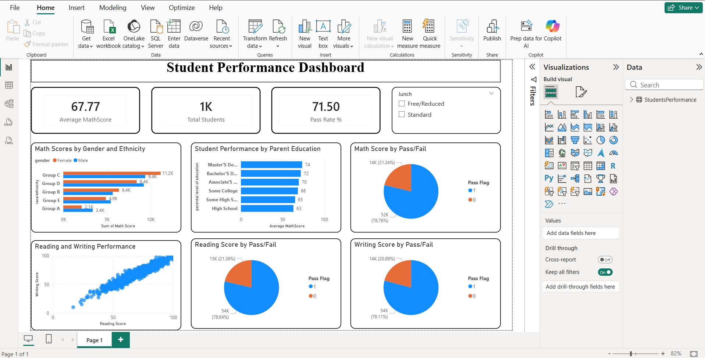

# 📊 Student Performance Dashboard

## 🔍 Overview
This project analyzes student performance using Power BI. It provides insights into academic results, pass rates, and factors influencing student success such as parental education and lunch type.

## 📸 Dashboard Preview

## 📁 Files
- Student_Performance_Dashboard.pbix

## 📊 Key Insights
- Overall pass rate and total student distribution
- Subject-wise performance (Math, Reading, Writing)
- Impact of parental education on student scores
- Gender and ethnicity-based performance comparison
- Relationship between reading and writing scores
- Pass vs fail analysis across subjects

## 🛠 Tools Used
- Power BI
- Excel
- Data Visualization
